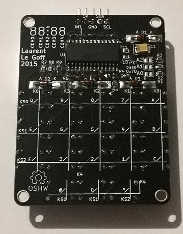
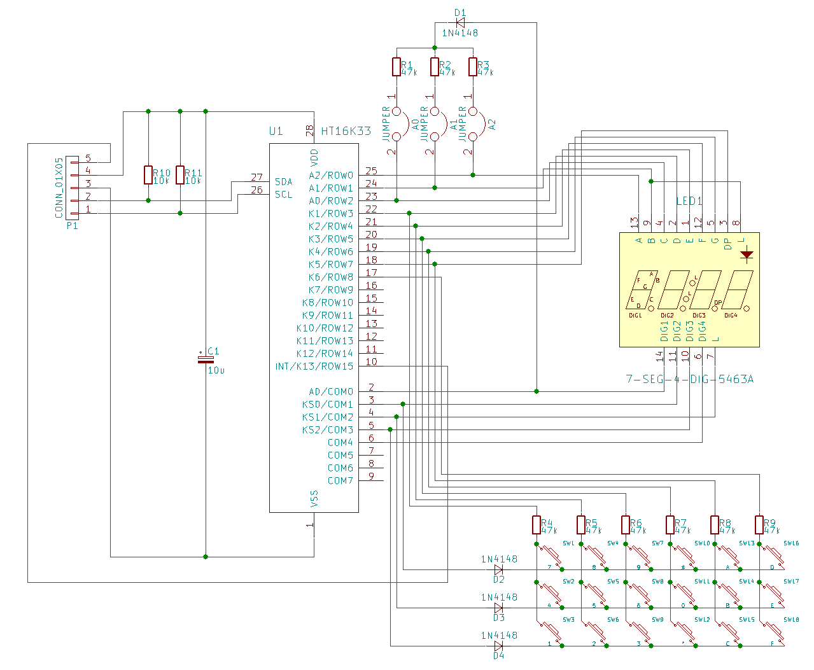

[:fr:](LISEZMOI.md) [:uk:](README.md)

# 7seg_htk16k33

Afficheur 4*7 segments avec clavier, piloté par le controleur Holtek HT16K33

interface I2C

Utilisez la librairie Adafruit (https://github.com/adafruit/Adafruit_LED_Backpack)
